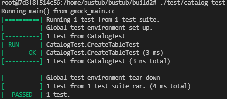
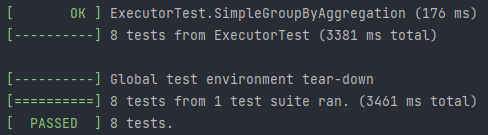
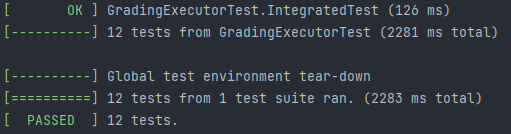

## 遇到的问题
##### 1.index\_names_为空
解决：Task1里面的CreateTable（）函数，对于新创建的表，不仅需要添加进tables\_和names\_这两个hash表中，还需要添加进index\_names_这个hash表中
##### 2.删除测试中，删除结束，对空表的索引进行验证时出错
原因：对空表的索引进行验证即对B+树查询的验证，B+树GetValue函数中会对空树执行GetSize操作，因而出错  
解决：在GetValue函数中对树是否为空进行判断
##### 3.索引扫描测试通不过
解决：Task1里面的CreateIndex（）函数，需要为表的每个元组添加索引
## 测试结果
本地测试全部通过，网页测试全部通过。  
  
  
