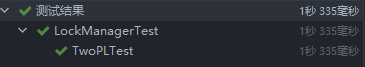

## 测试
  
  
  
  
  
  
  
目前`grading_rollback_test`尚未调试成功！

## 问题
#### 1.插入没办法在插入之前加锁，而如果插入后再加锁，则其他事务可能在插入后，上锁前访问该tuple。如何解决？
解决：在TableHeap::InsertTuple中在cur_page->InsertTuple的最后面加锁就可以保证上锁前该tuple不会被其他线程访问。  
但是测试里txnId为0的txn负责generate table，在测试结束时才提交，所以插入时不能加锁，其他事务插入时需要加锁。（这个又如何解决？）