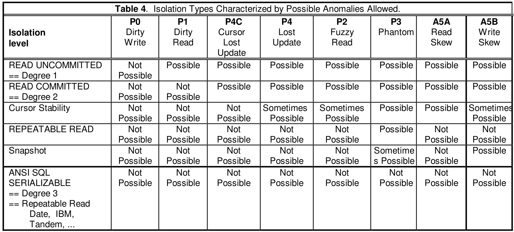
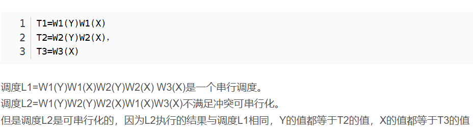

# Week14 思考问题

1. ### 什么是事务，为什么要有事务？事务的概念是数据库中独有的吗？事务是不是数据库必需的？  

​	事务是指是程序中一系列严密的逻辑操作，而且所有操作必须全部成功完成，否则在每个操作中所作的所有更改都会被撤消。

​	事务的提出就是为了解决并发情况下保持数据一致性的问题。事务是数据库维护数据一致性的单位，在每个事务结束时，都能保持数据一致性。

​	事务不是数据库独有。

​	事务不是数据库必需的，一些NoSQL数据库中没有事务这个概念。

2. ### 什么是事务的隔离级别，不同的隔离级别下事务执行时会出现什么异常？  

事务的隔离机制就是解决读写冲突的一个手段。  
**脏写（Dirty Write）**：T1修改item，在T1执行commit/rollback之前，T2随后也修改item。后续如果T1或者T2要执行rollback，就无法确定要rollback到哪个值了。  
**脏读（Dirty Read）**：读到了其他事务未提交的数据。 
**丢失更新（Lost Update）**：指在一个事务读取一个数据时，另外一个事务也访问了该数据，那么在第一个事务中修改了这个数据后，第二个事务也修改了这个数据。这样第一个事务内的修改结果就被丢失。 
**不可重复读（Non-repeatable or Fuzzy Read）**： 事务 1 读取了一行数据，而事务 2 在更改或删除该行后提交了更改。当事务 1 尝试再次读取该行时，它会检索到不同的数据值（如果该行已经被更新的话），或发现该行不复存在了（如果该行被删除的话）。 
**幻读（Phantom Read）**：事务 1 读取满足某个搜索条件的一组数据行，而事务 2 插入了与事务 1 的搜索条件匹配的新行。如果事务 1 再次执行产生原先行集的查询，就会检索到不同的行集。 
**读偏序（Read Skew）**：事务T1读取x，T2更新x，y，T1读取y，对于T1读取到的x和y不符合约束。 
**写偏序（Write Skew）**：T1读取x，T2读取y，T2更新了x，T1更新y。交叉更新。 
隔离级别共有六种：
**读未提交（Read uncommitted）**：一个事务可以读取另一个未提交事务的数据。 
**读已提交（Read committed）**：一个事务要等另一个事务提交后才能读取数据。 
**游标稳定性（Cursor stability）**：逐行锁定数据，该行数据未修改时，锁定解除，继续加锁读取下一行，该行数据有修改时，则该行锁定持续到事务终止。不能查看其他程序未COMMIT的更改。 
**可重复读（Repeatable read）**：锁定事务引用的所有行，直到COMMIT。其他程序不能修改该数据，如果一条数据被访问两次，返回相同的结果。 
**快照隔离（Snapshot Isolation）**：基于snapshot的事务隔离系统，永远读取事务开始时刻的数据版本Start-Timestamp。事务中的读操作永远不会被阻塞。其他事务的更新会在下一次Start-timestamp中被读取到。 
**可串行化（Serializable）**：事务串行化顺序执行。但是这种事务隔离级别效率低下，比较耗数据库性能，一般不使用。

3. ### 如何判断事务执行的正确性？什么是冲突可串行化？  
##### 可串行化：

​	串行调度是指多个事务依序串行执行，仅当一个事务的所有操作执行完后才执行另一个事务。这种调度方式下，不可能出现多个事务同时访问同一数据的问题，自然也就不可能出现并发错误。串行调度显然是正确的，但是串行调度无法充分利用系统资源，因此其效率显然也是用户难以接受的。并发调度是指在数据库系统中同时执行多个事务。DBMS对多个并发事务进行调度时，可能产生多个不同的调度序列，从而得到不同的执行结果。如何判断某个调度是不是正确呢？如果这些并发事务的执行结果与它们按某一次序串行执行的结果相同，则认为该并发调度是正确的，我们称之为可串行化调度。

##### 冲突可串行化：

​	可串行化是并发控制的正确性准则。但是按照可串行化的定义，如果想要判断一个并发调度是不是可串行化调度，需要知道这批事务所有可能的串行调度的结果，然后将该并发调度的结果与这些结果进行比较，这显然是难以实施的。因此，我们需要一种可操作的判断标准，即冲突可串行化。冲突可串行化是可串行化的充分条件。如果一个并发调度是冲突可串行化的，那么它一定是可串行化的。在定义冲突可串行化之前，需要先了解什么是冲突操作。冲突操作是指不同的事务对同一个数据的读写操作或写写操作。例如，事务1对数据A的读操作&quot;r1(A)&quot;与事务2对数据A的写操作&quot;w2(A)&quot;就是一对冲突操作。我们规定，不同事务的冲突操作的次序和同一事务的两个操作的次序是不能交换的。按照这个规定，在保证一个并发调度中的冲突操作次序不变的情况下，如果通过交换两个事务的非冲突操作，能够得到一个串行调度，则称该并发调度是冲突可串行化的。（分布式系统课程：两个事务中所有的冲突操作都按相同的次序在它们访问的对象上执行。）

例如，对于以下两个并发调度序列：

SC1：r1(A) w1(B) r2(B) w1(C) w2(B)

SC2：r1(B) r2(A) w1(A) w2(B)

SC1就是冲突可串行化的，因为可以通过交换非冲突操作3和4得到一个串行调度序列。而SC2则是非冲突可串行化的，因为操作2和3是冲突操作，无法交换。

4. ### 简要描述常用的事务并发控制算法( 基于锁，基于时戳，乐观并发，MVCC)  

   **基于锁**

   事务需要对资源进行操作时需要先获得资源对应的锁，保证其他事务不会访问该资源后，在对资源进行各种操作。

   为了最大化数据库事务的并发能力，数据库中的锁被设计为两种模式，分别是共享锁和互斥锁。当一个事务获得共享锁之后，它只可以进行读操作，所以共享锁也叫读锁；而当一个事务获得一行数据的互斥锁时，就可以对该行数据进行读和写操作，所以互斥锁也叫写锁。

   而两阶段锁协议（2PL）是一种能够保证事务**可串行化**的协议，它将事务的获取锁和释放锁划分成了增长（Growing）和缩减（Shrinking）两个不同的阶段。

   

   在增长阶段，一个事务可以获得锁但是不能释放锁；而在缩减阶段事务只可以释放锁，并不能获得新的锁。

   **基于时间戳**

   事务T在启动时分配一个唯一的时间戳TS(T)，并发控制保证存在一个等价的串行调度，该调度中的事务是按事务的启动时间先后顺序。为了实现这一点，基于时间戳顺序并发控制使用以下数据结构存储数据项x的以下信息：
   	1.rt(x)：任何读x的事务的最大时间戳
   	2.wt(x)：任何写x的事务的最大时间戳
   	3.f(x)：标志，用于表明最后写x的事务是否已提交

   使用上述数据结构进行读写并发控制的算法如下：

   当事务T1请求**读x时**
   1.第一种情况：TS(T1)<wt(x)
   读事务的启动时间小于最晚的写时间，意味着其他事务在T1后写入了新值，T1希望读到的原值已不存在，T1由于太“老”不能读，T1必须回滚

   2.第二种情况：TS(T1)>wt(x)
   读事务的启动时间大于最晚写入时间，这时候又分为分两种情况：
   A.f(x)标记x已提交，则请求被批准，如TS(T1)>rt(x)，则更新rt(x)为TS(T1)
   B.f(x)标记x未提交，则T1必须等待（否则会导致脏读）

   当事务T1请求**写x时**
   1.第一种情况：TS(T1)<rt(x)
   写事务的时间比最晚的读时间要早，意味着过晚的写，T1太老不能写，T1必须回滚

   2.第二种情况：rt(x)<TS(T1)<wt(x)
   写事务的启动时间大于最晚读时间，小于最晚写时间
   如f(x)标记x已提交，则根据Thomas写规则，请求被批准，但没有任何的实际动作（因为T1写的x值不会被任何其他事务读取）
   如f(x)标记x未提交，T1必须等待（否则会导致脏写）

   3.第三种情况：wt(x)<rt(x)<TS(T1)
   写事务的启动时间比最晚读时间要大，且最晚读时间比最晚写时间要晚
   如f(x)标记x未提交，那么T1必须等待（否则会导致脏写）
   如f(x)标记x已提交，那么请求被批准，TS(T1)值赋予wt(x)，f(x)值设置为未提交

   **乐观并发**

   在乐观并发控制中，用户读取数据时不锁定数据。当一个用户更新数据时，系统将进行检查，查看该用户读取数据后其他用户是否又更改了该数据。如果其他用户更新了数据，将产生一个错误。一般情况下，收到错误信息的用户将回滚事务并重新开始。

   **MVCC**

   MVCC(Multi-version Concurrent Control)：多版本并发控制。基于保存多个数据版本实现的并发控制，当需要更新数据时，实现了MVCC的系统不会立即用新数据覆盖原始数据，而是创建该条记录的一个新版本。

5. ### **什么是分布式事务，2PC和3PC。**

   单机事务主要面向单机版、单数据库的事务概念，而分布式事务 指事务的参与者、支持事务的服务器、资源服务器以及事务管理器分别位于不同的分布式系统的不同节点之上 。而在分布式的环境下，仍然要考虑保证事务的ACID特性。

   **2PC( Two-phase Commit )**

   两阶段提交，顾名思义就是要分两步提交。

   

   

   ​		这里第一阶段称为准备或者投票阶段。引入一个负责协调各个本地资源管理器的事务管理器，本地资源管理器一般是由数据库实现，事务管理器在第一阶段的时候询问各个资源管理器是否都就绪，并执行完除提交事务外所有事情，然后把结果返回给事务协调者。

   

   如果收到每个资源的回复都是 成功，则在第二阶段提交事务，如果其中任意一个资源的回复是 失败, 则回滚事务。

   两阶段协议存在的问题：

   1、**同步阻塞问题**。
   执行过程中，所有参与节点都是事务阻塞型的。当参与者占有公共资源时，其他第三方节点访问公共资源不得不处于阻塞状态。也就是说从投票阶段到提交阶段完成这段时间，资源是被锁住的。

   2、**单点故障**。由于协调者的重要性，**一旦协调者发生故障。参与者会一直阻塞下去。**
   尤其在第二阶段，协调者发生故障，那么所有的参与者还都处于**锁定事务资源的状态中**，而无法继续完成事务操作。
   （可以重新选举一个协调者，但是**无法解决因为协调者宕机导致的参与者处于阻塞状态的问题**）

   3、**数据不一致**。在二阶段提交的**阶段二中**，当协调者向参与者发送commit请求之后，发生了局部网络异常或者在发送commit请求过程中协调者发生了故障，这回导致只有一部分参与者接受到了commit请求。而在这部分参与者接到commit请求之后就会执行commit操作。但是其他部分未接到commit请求的机器则无法执行事务提交。于是整个分布式系统便出现了数据不一致性的现象。

   4、二阶段无法解决的问题：------ **极限情况下,对某一事务的不确定性**
   如果协调者在发出commit消息之后宕机，而唯一接收到这条消息的参与者同时也宕机了。那么即使协调者通过选举协议产生了新的协调者，这条事务的状态也是**不确定**的，没人知道事务是否被已经提交。

   

   **3PC( Three-phase Commit )**

   3PC的引入主要是为了解决2PC的缺点，如何解决？

   与两阶段提交不同的是，三阶段提交有两个改动点。

   > 1、引入**超时机制**。同时在协调者和参与者中都引入超时机制。
   > 2、在第一阶段和第二阶段中插入一个**准备阶段，**保证了在最后提交阶段之前各参与节点状态的一致。

   也就是说，除了引入超时机制之外，3PC把**2PC的投票阶段再次一分为二**，这样三阶段提交就有`CanCommit`、`PreCommit`、`DoCommit`三个阶段。

   

   引入can-Commit阶段，**主要是为了在预执行之前，保证所有参与者都具备可执行条件，从而减少资源浪费。**

   相对于2PC，**3PC主要解决的单点故障问题，并减少阻塞，**因为一旦参与者无法及时收到来自协调者的信息之后，他会默认执行commit。而不会一直持有事务资源并处于阻塞状态。

   **为什么默认执行commit？**

   当进入第三阶段时，说明参与者在第二阶段已经收到了PreCommit请求，那么Coordinator产生PreCommit请求的前提条件是他在第二阶段开始之前，收到所有参与者的CanCommit响应都是Yes。**因此当进入第三阶段时，由于网络超时等原因，虽然参与者没有收到commit或者abort响应，但是他有理由相信：成功提交的几率很大。**

   可以看到3PC由于多引入了一个阶段，性能会有所降低，而且也没有解决数据一致性问题，使用不是特别广泛。
