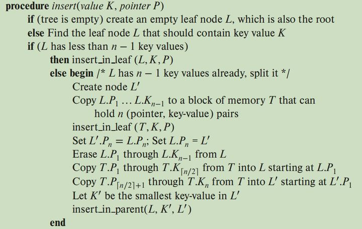
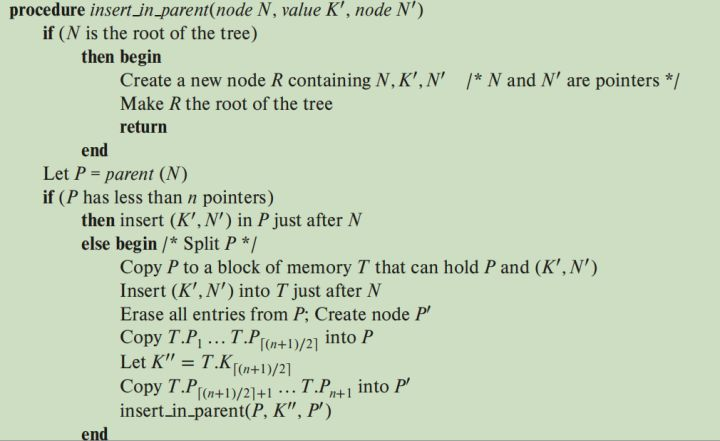
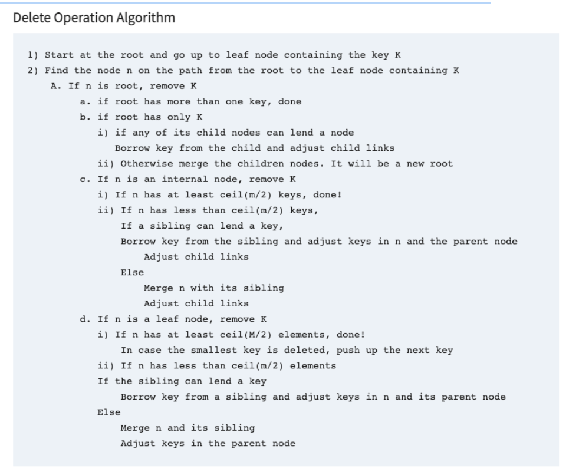

# Task #1. - B+Tree Pages

## B+ Tree Parent Page
##### 1.引用`buffer_pool_manager.h`
每个B + Tree叶子/内部页面对应从缓冲池获取的存储页面的内容（即data\_部分）。因此，每次尝试读取或写入叶子/内部页面时，都需要首先使用其唯一的page\_id从缓冲池中提取页面，然后将其重新解释为叶子或内部页面，并在写入或删除后执行unpin操作。
需要用到FetchPageImpl函数和UnpinPageImpl函数。
##### 2.引用`generic_key.h`
比较器comparator定义
##### 3.函数说明：
* IsLeafPage：是否是叶节点的页，通过页面类型确定
* IsRootPage：是否是根节点的页，通过页面类型及父节点是否为空确定
* SetPageType：设置页面类型
* GetSize：得到页面中的键值对数
* SetSize：设置页面中的键值对数
* IncreaseSize：增加页面中的键值对数
* GetMaxSize：得到页面的最大容量
* SetMaxSize：设置页面的最大容量
* GetMinSize：得到页面的最小容量  
1.根节点需判断是否是叶子节点。是叶子节点的话不需要存指针，所以最小值为1.如果不是叶子节点，则需要一个数组存放空key+指针，而至少得有一个key存在，所以最小值为2。  
2.叶子节点和内部节点：max\_size_/2向下取整
* GetParentPageId:得到父页面Id
* SetParentPageId:设置父页面Id
* GetPageId:得到自页面Id
* SetPageId:设置自页面Id
* SetLSN:设置日志序列号
##### 4.参数说明
* page_type_：页面类型（内部或叶），定义了页面类型的枚举
* lsn_：日志序列号（用于项目 4）
* size_：页面中的键值对数
* max_size_：页面中键值对数的最大数
* parent_page_id_：父页面 Id
* page_id_：自页 ID

## B+ Tree Internal Page
##### 1.引用`b_plus_tree_page.h`
##### 2.函数说明
* Init：创建一个新的内部页面后进行初始化
* KeyAt：得到键值对数组对应偏移的key
* SetKeyAt：设置键值对数组对应偏移的key
* ValueIndex：找到输入的value对应的键值对数组偏移
* ValueAt：得到键值对数组对应偏移的value（page_id)
* Lookup：找到包含key的孩子页面并返回页面指针（二分查找）。comparator(a,b)比较器在`generic_key.h`中定义，a<b返回-1；a>b返回1；a=b返回0
* PopulateNewRoot：填充新的根节点页面
* InsertNodeAfter：在值=oldvalue的键值对后面插入新的键值对
* MoveHalfTo：将一半的键值对移到另一页上，同时要修改指针指向的孩子节点的父节点id  
* CopyNFrom：从items进行复制，复制size个键值对。因为需要修改父页面id，所以需要使用BufferPoolManager。
- - - 
**插入完成**
- - -
* Remove：根据输入的键值对数组偏移删除对应的键值对
* RemoveAndReturnOnlyChild：删除唯一的键值对并将value值返回（只在AdjustRoot函数中调用）
* MoveAllTo：将全部的键值对移到另一页上，同时要修改指针指向的孩子节点的父节点id，注意在合并时第一个键值对的空key为父节点对应的key
* CopyLastFrom：将输入的键值对添加到该页的最后，因为是内部节点，所以需要修改被移除页的父页面id
* MoveFirstToEndOf：将第一对键值对从该页移到另一页的最后，因为是内部节点，所以需要修改被移除页的父页面id
* MoveLastToFrontOf：将最后一对对键值对从该页移到另一页的开头，因为是内部节点，所以需要修改被移除页的父页面id，注意该键值对的key应该添加到原本的空key上，使第一对键值对的key为空
* CopyFirstFrom：将输入的键值对添加到该页的开头，因为是内部节点，所以需要修改被移除页的父页面id
##### 3.参数说明
* array[0]：键值对，存放key+page_id

## B+ Tree Leaf Page
##### 1.引用`b_plus_tree_page.h`
##### 2.函数说明
* Init：创建一个新的叶子页面后进行初始化
* GetNextPageId：得到下一个兄弟节点的page_id
* SetNextPageId：设置下一个兄弟节点的page_id
* GetPrePageId：得到上一个兄弟节点的page_id（自己增加的函数）
* SetPrePageId：设置上一个兄弟节点的page_id（自己增加的函数）
* KeyAt：得到键值对数组对应偏移的key
* KeyIndex：找到第一个大于等于输入值的key所在的键值对（二分查找）
* GetItem：得到键值对数组对应偏移的key和rid
* Insert：在叶子上插入键值对
* Lookup：对于输入的key，检查它是否在叶页面上。如果在，就将对应键值对的value输出；否则返回false。
* MoveHalfTo：将一半的键值对移到另一页上
* CopyNFrom：从items进行复制，复制size个键值对
- - -
**插入完成**
- - - 
* RemoveAndDeleteRecord：删除键值对。首先查找其是否在该页面上，如果在则进行删除，否则直接返回键值对数。
* MoveAllTo：将全部的键值对移到另一页上，同时要修改兄弟节点id
* MoveFirstToEndOf：将第一对键值对从该页移到另一页的最后
* MoveLastToFrontOf：将最后一对对键值对从该页移到另一页的开头
* CopyLastFrom：将输入的键值对添加到该页的最后
* CopyFirstFrom：将输入的键值对添加到该页的开头

##### 3.参数说明
* array[0]：键值对，存放key+rid
* next\_page\_id_：下一个节点的page\_id，实现叶子节点的兄弟节点
* pre\_page\_id\_：(自己增加的参数）上一个节点的page\_id，实现叶子节点的兄弟节点

# Task #2.a - B+Tree Data Structure (Insertion & Point Search)
## b\_plus_tree.cpp函数说明
##### 1.IsEmpty
根据根页面id是否为无效id，判断树是否为空
##### 2.GetValue
点查询  
1.使用FindLeafPage函数找到该键值对所在范围的叶页面  
2.使用Lookup函数判断该值是否在叶页面中
##### 3.Insert
插入算法：  
  
1.如果当前树为空，则创建一棵新树，更新根页面id并插入  
2.否则寻找到插入元素应该在的叶页面，并插入  
（1）找到叶页面  
（2）如果叶页面的节点数小于最大容量，则直接插入  
（3）否则将该叶页面分裂为两个叶页面，并将中间键值对上提  
（4）如果分裂后的父页面依然需要分裂，则递归进行分裂，否则结束该轮插入操作
##### 4.StartNewTree
插入一个键值对到一棵空树上。  
1.使用缓冲池管理器的NewPage函数获得一个新页面及新页面id  
2.如果该新页面是空的，扔出"out of memory"  
3.否则更新B+树的根页面id，并将键值对直接插入叶页面（根页面）  
##### 5.UpdateRootPageId
更新/插入根页面id到头部页面（该代码已有）  
每次根页面id改变时都需要调用该函数  
参数insert\_record：当该值为false时进行更新操作，当该值为true时进行插入操作
##### 6.InsertIntoLeaf
1.使用FindLeafPage函数找到该键值对所要插入的叶页面  
2.如果key已经在这个页面中，则释放该页面的pin并返回false  
3.否则将该键值对插入叶页面  
4.如果插入后页面的容量超过最大容量，则需进行分裂，并增加父页面的键值对  
5.释放该页面的pin并返回true  
##### 7.Split
1.使用缓冲池管理器的NewPage函数获得一个新页面及新页面id  
2.如果该新页面是空的，扔出"out of memory"  
3.如果旧页面不是叶页面，直接移动一半的键值对从旧页面到新页面，并返回新页面  
4.如果旧页面是叶页面，移动一半的键值对从旧页面到新页面，同时还需更新兄弟节点
##### 8.InsertIntoParent
插入父页面算法：  
   
1.如果旧页面是根页面，分裂后就需要创建一个新的页面当作根页面（父页面），输入的key成为根页面第二个键值对的key，同时修改新旧页面的父页面id以及根页面的两个指向孩子页面的指针  
2.如果不是根页面，直接对父页面插入指向新页面的指针以及对应的key  
3.如果父页面依然需要进行分裂，则递归调用该函数
##### 9.FindLeafPage
从根页面向下查找，直到在叶页面找到应该插入的叶页面  
1.如果B+树为空，返回空  
2.从根页面开始，如果页面不是叶页面，则找到对应范围的孩子页面（如果leftMost为true，则找最左边的叶页面（即空key指向的页面）  
3.直到找到叶页面为止  

## 参数说明
* index\_name_：节点的名字
* root\_page\_id\_：根页面id
* *buffer\_pool\_manager\_：缓冲池管理器
* comparator_：比较器
* leaf\_max\_size_：叶页面的最大容量
* internal\_max\_size_：内部页面的最大容量

# Task #2.b - B+Tree Data Structure (Deletion)
## b\_plus_tree.cpp函数说明
##### 1.Remove
  
1.如果树是空的，直接返回  
2.如果不是，找到删除元素应该在的叶页面，进行删除  
（1）找到删除元素应该在的叶页面，进行删除  
（2）如果删除后的页面size小于页面的最小容量，则需要考虑借键值对或合并节点  
##### 2.CoalesceOrRedistribute
1.如果输入的节点为根节点，则调用AdjustRoot函数  
2.否则找到输入页面的兄弟节点（先考虑左兄弟节点，再考虑右兄弟节点）  
3.如果兄弟节点的size加输入页面的size大于页面的最大容量，则对这两个节点的键值对进行重新分配（即向兄弟节点借键值对）  
4.否则，将该页面与兄弟节点进行合并  
##### 3.Coalesce
1.将所有的键值对从该页移到兄弟节点上（需要区分叶页面还是内部页面）  
2.在父节点删除对应的键值对  
3.递归判断父节点是否需要进行借键值对或进行合并  
##### 4.Redistribute
向兄弟节点借键值对  
1.如果index等于0，将兄弟节点所在页面在父页面对应的key值和第一个page id值移到输入节点的尾部，用第二个键值对的key值代替父页面移走的key值  
2.如果index不等于0，将兄弟节点所在页面在父页面对应的key值和最后一个page id值移到输入节点的头部，用最后一个键值对的key值代替父页面移走的key值
##### 5.AdjustRoot
Case1：old\_root\_node是内部结点，且大小为1，表示内部节点其实已经没有key了。所以要将该节点删除并把它的孩子更新成新的根节点  
Case2：old\_root\_node是叶子节点，且大小为0，直接删除，更新根页面

# Task #3 - Index Iterator
## b\_plus_tree.cpp函数说明
##### 1.begin
返回第一个叶页面
##### 2.Begin
返回key值所在的叶页面
##### 3.end
返回最后一个叶页面的最后一对键值对的后面那个

## index_iterator.h函数说明
##### 1.operator==
必须page id和键值对偏移都相同
##### 2.operator!=
page id和键值对偏移其中一个不同就不相等

## index_iterator.h参数说明
* page\_id_
* *page_
* index_
* *leaf_
* *buffer\_pool\_manager_

## index_iterator.cpp函数说明
##### 1.isEnd
判断迭代是否结束
##### 2.operator*
返回对应偏移的键值对
##### 3.operator++
迭代器往后平移，当该页遍历结束，需要从右兄弟节点继续遍历

# Task #4 - Concurrent Index
## 对b\_plus_tree.cpp函数的修改
##### 1.b\_plus\_tree_page.h
增加一个枚举定义OpType用来表示操作的类型是读，插入还是删除  
`enum class OpType { READ = 0, INSERT, DELETE };`  
增加参数：虚拟根节点锁`ReaderWriterLatch root_id_latch_`
##### 2.增加函数ReleaseLatchQueue
释放前面拿到的锁，同时当该队列为空时要释放虚拟根节点锁
##### 3.增加函数IsSafe
判断插入和删除操作是否安全  
1.如果是插入操作，则只要当前node的size处于安全状态即 + 1 之后不会产生分裂，则为安全  
2.如果是删除状态。则只要当前node的size - 1 之后不会重分配或者合并，则为安全  
3.对于根节点需要进行特殊判断。如果这个根节点是叶子结点则为安全；否则根节点的大小必须大于2  
##### 4.增加函数DeletePages
删除在删除队列中的页（由于该页在进程进行中页面加锁导致无法进行删除操作，所以得等到进程结束锁释放掉之后再进行删除）
##### 5.FindLeafPage
由于该函数被插入和删除都进行了调用，所以需要增加函数参数Optype和Transaction  
每次往下找到页面时要判断是否是读写操作以及该操作是否安全，同时要将该页加入加锁页的集合
##### 6.InsertIntoLeaf

##### 7.

## 对index_iterator.cpp函数的修改

## 对b\_plus_tree.cpp参数的修改
增加参数`root_id_latch_`代表根节点锁

