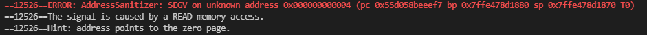

## 遇到的问题
##### 1.googletest下载总是失败
解决：在`build_support/gtest_CMakeLists.txt`中将git的下载地址改为镜像源地址`https://hub.fastgit.org/google/googletest.git`
##### 2.测试打印的时候一直报内存泄漏的问题
解决:`b_plus_tree.cpp`里面有个`FindLeafPage`函数，最开始有段代码是：  
`throw Exception(ExceptionType::NOT_IMPLEMENTED, "Implement this for test");`  
删除这段代码即可。
##### 3.测试插入的时候遇到读空页的情况

解决：写迭代器里面有个函数`operator++`，if条件语句需要判断该页的兄弟节点的page id是否为空