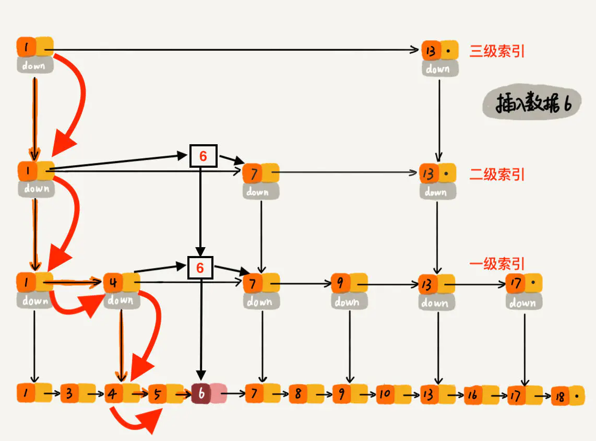

# 跳表代码结构整理
## Node
##### 成员变量
* next_[1]
##### 成员函数
* Next：得到当前节点在当前层数的下一个节点
* SetNext：设置当前节点在当前层数下一个节点为x
* NoBarrier_Next：不考虑并发的函数
* NoBarrier_SetNext：不考虑并发的函数

## skiplist
##### 成员变量
* compare_：比较器
* arena_：用于申请节点
* head_：头指针
* max\_height_：当前整个链表的高度（定义了链表的最大高度为12）
* rnd_：用于插入操作生成节点的随机高度
##### 成员函数
提供Insert和Contains两个公开接口  
leveldb中跳表没有删除操作，因为level所有的都是追加写，不会去删除之前的版本

* RandomHeight：在插入时获得节点的随机高度
* KeyIsAfterNode：判断key值是否在该节点之后
* FindGreaterOrEqual：找到刚好大于等于key值的节点，并记录该节点在每层的前一个结点  
从最顶层的第一个节点开始，优先向右查找。当下一个节点大于等于该key值时，向下查找，并将当前节点记录在当前层的prev数组中。如果当前在第一层，就返回刚好大于等于key值的节点。
* FindLessThan：找到刚好小于等于key值的节点。过程与FindGreaterOrEqual相似
* FindLast：找到第一层的最后一个节点。过程与FindGreaterOrEqual相似
* Insert：，找到刚好大于等于key值的节点。先对插入的节点产生一个随机高度，如果高度大于当前链表的高度，将超出部分的prev数组设置为头节点。然后利用链表特性插入节点，修改每一层的指针。   
注意：修改指针时，先使用无并发的函数修改后继指针，再使用考虑并发的函数修改前驱指针。以这种方式实现无锁并发。
  
* Contains：判断该key值是否已经在链表中

## 迭代器
##### 成员变量
* list_：链表
* node_：节点
##### 成员函数
* Valid：判断节点是否为空
* key：返回节点的key值
* Next：使当前节点变为在第一层的下一个节点
* Prev：使当前节点变为在第一层的上一个节点
* Seek：找到刚好大于等于输入key值的节点
* SeekToFirst：找到链表在第一层的第一个节点
* SeekToLast：找到链表在第一层的最后一个节点

## 问题
##### 1.对比下B+树和跳表的异同，思考为啥选择使用跳表 
1.相同点：都支持单条记录的增、删、读、改操作，还支持顺序扫描  
2.不同点：  
B+树：  
以数据块的大小存在磁盘上   
跳表：  
存在内存中  
3.为什么使用跳表：  
leveldb是内存数据库
##### 2.对比下B+树和跳表，在大量写入情况下的不足之处
B+树：需要花费大量开销维护节点的分裂和合并，极端情况下会导致内存和磁盘大量换入换出  
跳表：需要维护跳表每层链表的插入删除
##### 3.分析leveidb中skiplist的并发部分实现，分析有锁并发和无锁并发的区别和适用条件
leveldb中skiplist使用了node节点在并发和无并发条件下的两种函数，当线程是绝对安全的情况下只需要使用无并发的函数，这样能提高插入性能。

有锁并发：悲观策略  
优点：
1、编程模型简单，如果小心控制上锁顺序，一般来说不会有死锁的问题；  
2、可以通过调节锁的粒度来调节性能。  
缺点：  
1、所有基于锁的算法都有死锁的可能；  
2、上锁和解锁时进程要从用户态切换到内核态，并可能伴随有线程的调度、上下文切换等，开销比较重；  
3、对共享数据的读与写之间会有互斥。  

无锁并发：乐观策略  
一般是基于CAS(Compare And Swap)操作鉴别线程冲突：  
CAS算法的过程是这样：它包含三个参数CAS(V,E,N)。V表示要更新的变量，E表示预期值，N表示新值。仅当V值等于E值时，才会将V的值设为N，如果V值和E值不同，则说明已经有其他线程做了更新，则当前线程什么都不做。最后，CAS返回当前V的真实值。
优点：
1、开销较小：不需要进入内核，不需要切换线程；
2、没有死锁：总线锁最长持续为一次read+write的时间；
3、只有写操作需要使用CAS，读操作与串行代码完全相同，可实现读写不互斥。
